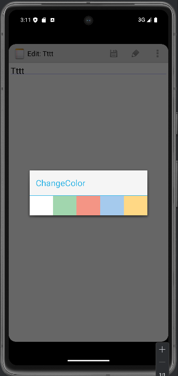

# 期中实验---NotePad

### 项目简介

通过Android开发实现了谷歌开源项目NotePad的功能拓展，其中包括笔记时间戳，搜索，UI美化，排序功能。

### 项目目标

本项目的目标是开发一个轻量化、高效且功能实用的记事本应用，专注于提升用户在日常记录、管理笔记过程中的便捷性和效率。通过在原有谷歌开源项目NotePad的基础上进行功能扩展，旨在解决以下核心问题：

1. **简化记录过程**：为用户提供一个快速、直观的笔记创建、编辑和删除功能，避免复杂的操作，确保用户能够迅速记录下重要信息。
2. **高效笔记管理**：随着笔记数量的增加，提供便捷的检索和分类功能，帮助用户快速定位所需信息，提升管理效率。
3. **优化用户体验**：通过美化界面和提供个性化主题选择，打造一个简洁而美观的应用界面，使用户在使用过程中既能享受清爽的视觉体验，也能感受到操作的流畅性。
4. **增强可扩展性与可维护性**：采用模块化开发，确保各功能模块相互独立，易于维护和拓展，未来可根据用户需求进一步增加新功能或进行改进。
5. **数据安全与稳定性**：使用SQLite数据库进行数据存储，确保笔记内容的安全性与稳定性，保证用户数据的持久性。

## 功能示例与核心代码说明

### 基本功能1---时间戳功能


我们首先在layout中的notelist_item.xml的列表项中添加新的TextView用来接受时间戳

```xml
<TextView
    android:id="@android:id/text2"
    android:layout_width="match_parent"
    android:layout_height="wrap_content"
    android:textAppearance="?android:attr/textAppearanceLarge"
    android:gravity="center_vertical"
    android:paddingLeft="5dp"
    android:singleLine="true" />
```

并且在NotePad.java中添加修改时间常量的定义

```java
public static final String COLUMN_NAME_MODIFICATION_DATE = "modified";
```

然后我们需要在查询数组PROJECTION中添加修改时间的显示，并且在dataColumns数组中也加入修改时间的常量以及viewIDs中增加刚刚在noteslist_item.xml中增加的text2文本

```java
private static final String[] PROJECTION = new String[] {
        NotePad.Notes._ID, // 0
        NotePad.Notes.COLUMN_NAME_TITLE, // 1
        NotePad.Notes.COLUMN_NAME_MODIFICATION_DATE,//在这里加入了修改时间的显示

};
```

```java

String[] dataColumns = { NotePad.Notes.COLUMN_NAME_TITLE, NotePad.Notes.COLUMN_NAME_MODIFICATION_DATE} ;


int[] viewIDs = { android.R.id.text1,android.R.id.text2 };
```

最后最重要的是这段代码用于获取当前时间并将其格式化为 `"yy/MM/dd HH:mm"` 的字符串格式，然后将格式化后的时间存入 `ContentValues` 对象，准备更新到数据库中对应笔记的修改时间字段 (`COLUMN_NAME_MODIFICATION_DATE`)。

在NoteEditor.java中的updateNote方法中增加时间戳的格式修改，不然时间戳显示出来就是一连串数字

```java
    private final void updateNote(String text, String title) {

        // Sets up a map to contain values to be updated in the provider.
        ContentValues values = new ContentValues();

        // 获取当前时间
        long now = System.currentTimeMillis();
        Calendar calendar = Calendar.getInstance();
        calendar.setTimeInMillis(now);

        // 格式化时间
        String formattedDate = DateFormat.format("yy/MM/dd HH:mm", calendar).toString();

        // 将格式化后的日期值放入 ContentValues
        values.put(NotePad.Notes.COLUMN_NAME_MODIFICATION_DATE, formattedDate);
        ......
    }
```

### 基础功能2---搜索功能


首先我们需要在menu/list_option_menu.xml文件中增加新的一个菜单项menu_search用来点击跳转搜索界面

```xml
<item
    android:id="@+id/menu_search"
    android:icon="@android:drawable/ic_menu_search"
    android:background="?android:attr/selectableItemBackground"
    android:title="@string/menu_search"
    android:showAsAction="always" />
```

然后我们需要创建NoteSearch.java以及layout中创建note_search.xml用来完成搜索界面

在note_search.xml中我加入了返回按钮，搜索输入框以及搜索结果的列表。

```xml
<?xml version="1.0" encoding="utf-8"?>
<LinearLayout xmlns:android="http://schemas.android.com/apk/res/android"
    android:layout_width="match_parent"
    android:layout_height="match_parent"
    android:orientation="vertical">
    <Button
        android:id="@+id/back_button"
        android:layout_width="wrap_content"
        android:layout_height="wrap_content"
        android:text="返回"
        android:layout_margin="8dp"
        android:layout_gravity="start" />
    <SearchView
        android:id="@+id/search_view"
        android:layout_width="match_parent"
        android:layout_height="wrap_content"
        android:iconifiedByDefault="false"
        />
    <ListView
        android:id="@+id/list_view"
        android:layout_width="match_parent"
        android:layout_height="wrap_content"
        />
</LinearLayout>
```

因为NoteSearch.java代码篇幅较长，这里分开说明

首先我们需要在NoteSearch类实现 `SearchView` 组件搜索功能时常用的一个接口，从而能够处理 `SearchView` 的文本输入事件，可以处理 `SearchView` 中的搜索文本变化，并在文本变化时更新 UI 或执行查询等操作。

```java
public class NoteSearch extends Activity implements SearchView.OnQueryTextListener 
```

在 onCreate 方法中，还初始化了 ListView 和 SearchView 控件。
获取 Intent，如果没有提供 URI，则设置默认 URI（NotePad.Notes.CONTENT_URI）。
使用 NotePadProvider.DatabaseHelper 获取可读的数据库实例。
配置 SearchView，启用提交按钮、设置查询提示文本，并将当前活动作为监听器，以便处理用户输入。

```java
 protected void onCreate(Bundle savedInstanceState) {
        super.onCreate(savedInstanceState);
        setContentView(R.layout.note_search);

        // 获取布局中的 SearchView 和 ListView 控件
        SearchView searchView = (SearchView) findViewById(R.id.search_view);
        listView = (ListView) findViewById(R.id.list_view);

        // 确保 ListView 已正确初始化
        if (listView == null) {
            Log.e("NoteSearch", "ListView is null in onCreate!");
        } else {
            Log.d("NoteSearch", "ListView initialized successfully");
        }

        // 获取 Intent 数据，如果没有，则使用默认 URI
        Intent intent = getIntent();
        if (intent.getData() == null) {
            intent.setData(NotePad.Notes.CONTENT_URI); // 默认使用笔记内容 URI
        }

        // 获取数据库的可读实例
        sqLiteDatabase = new NotePadProvider.DatabaseHelper(this).getReadableDatabase();

        // 设置 SearchView 显示提交按钮，并设置提示文本
        searchView.setSubmitButtonEnabled(true);
        searchView.setQueryHint("查找");
        searchView.setOnQueryTextListener(this); // 设置查询文本监听器
    }

```

onQueryTextSubmit 方法会在用户提交查询时触发，展示用户输入的查询内容（通过 Toast）。

```java
public boolean onQueryTextSubmit(String query) {
    // 当提交查询时显示用户输入的内容
    Toast.makeText(this, "您搜索的是：" + query, Toast.LENGTH_SHORT).show();
    return false;
}


```

onQueryTextChange 方法会在查询文本变化时触发。此方法用于构建 SQL 查询语句，通过 LIKE 操作符进行模糊匹配标题或笔记内容，查询符合条件的笔记记录。
使用 sqLiteDatabase.query 执行查询，并将返回的结果（Cursor）绑定到 ListView 上。
查询结果包括笔记的标题、修改日期和内容等字段。

ListView 的 OnItemClickListener 监听用户的点击操作，根据点击项的 ID 创建一个 URI。
如果 Intent 的 action 是 ACTION_PICK 或 ACTION_GET_CONTENT，则返回选中的 URI 结果。
否则启动编辑界面（Intent.ACTION_EDIT），并将选中的笔记 URI 传递给编辑界面。

同时设定了Button 控件（返回按钮）绑定点击事件，点击时结束当前活动，返回到上一个界面。

```java
public boolean onQueryTextChange(String newText) {
    // 构建 SQL 查询条件，模糊匹配标题或笔记内容
    String selection = NotePad.Notes.COLUMN_NAME_TITLE + " LIKE ? OR " + NotePad.Notes.COLUMN_NAME_NOTE + " LIKE ?";
    String[] selectionArgs = {"%" + newText + "%", "%" + newText + "%"};

    // 执行查询，返回符合条件的记录
    Cursor cursor = sqLiteDatabase.query(
            NotePad.Notes.TABLE_NAME,   // 查询的表名
            PROJECTION,                 // 查询的列
            selection,                  // 查询条件
            selectionArgs,             // 查询条件的参数
            null,                       // 不需要分组
            null,                       // 不需要行分组
            NotePad.Notes.DEFAULT_SORT_ORDER // 排序规则
    );

    // 输出查询结果数量，用于调试
    Log.d("NoteSearch", "Query returned " + cursor.getCount() + " rows.");

    // 如果没有匹配的记录，输出调试信息
    if (cursor.getCount() == 0) {
        Log.d("NoteSearch", "No matching results found.");
    }

    // 配置 ListView 的适配器，展示查询结果
    String[] dataColumns = {
            NotePad.Notes.COLUMN_NAME_TITLE,         // 显示标题
            NotePad.Notes.COLUMN_NAME_MODIFICATION_DATE, // 显示修改日期
    };

    int[] viewIDs = {
            android.R.id.text1,  // 显示标题
            android.R.id.text2,  // 显示修改日期
    };

    // 创建自定义的适配器，并设置给 ListView
    MyAdapter adapter = new MyAdapter(
            this,                     // 上下文
            R.layout.noteslist_item,  // 列表项布局
            cursor,                   // 查询结果的 Cursor
            dataColumns,              // 数据列
            viewIDs                   // 显示控件的 ID
    );

    listView.setAdapter(adapter); // 设置 ListView 的适配器

    // 设置 ListView 的点击事件，选择一项后打开编辑界面或返回数据
    listView.setOnItemClickListener(new AdapterView.OnItemClickListener() {
        @Override
        public void onItemClick(AdapterView<?> parent, View view, int position, long id) {
            // 根据记录的 ID 创建对应的 URI
            Uri uri = ContentUris.withAppendedId(getIntent().getData(), id);

            // 获取传入 Intent 的 action 类型
            String action = getIntent().getAction();

            // 根据不同的 action 处理不同的操作
            if (Intent.ACTION_PICK.equals(action) || Intent.ACTION_GET_CONTENT.equals(action)) {
                // 如果是 PICK 或 GET_CONTENT 操作，返回选中的 URI
                setResult(RESULT_OK, new Intent().setData(uri));
            } else {
                // 否则启动编辑 Activity
                startActivity(new Intent(Intent.ACTION_EDIT, uri));
            }
        }
    });

    // 设置返回按钮的点击事件，返回到上一个页面
    Button backButton = (Button) findViewById(R.id.back_button);
    backButton.setOnClickListener(new View.OnClickListener() {
        @Override
        public void onClick(View v) {
            finish(); // 结束当前 Activity
        }
    });

    return true;
}
```

在完成以上操作后我们需要在NotesList.java中的onOptionsItemSelected 方法中添加点击查询按钮后的处理，跳转至NoteSearch界面。

```java
case R.id.menu_search:
            //查找功能
            //startActivity(new Intent(Intent.ACTION_SEARCH, getIntent().getData()));
            Intent intent = new Intent(this, NoteSearch.class);
            this.startActivity(intent);
            return true;
```

最后最重要的是要在AndroidManifest.xml中声明一下NoteSearch页面，我们就完成了搜索界面。

```xml
<activity android:name="NoteSearch"
    android:theme="@android:style/Theme.Holo.Light"
    >
```

### 扩展功能1---UI美化

修改前：


修改后：


首先进行最简单的UI美化，我们将NoteList界面与NoteSearch界面的主题更改为明亮主题

```xml
        <activity android:name="NotesList" android:label="@string/title_notes_list"
            android:theme="@android:style/Theme.Holo.Light">
        <activity android:name="NoteSearch"
            android:theme="@android:style/Theme.Holo.Light"
            >
```

而后我们实现内容预览，首先要在notelist_item.xml中加入一个新的TextView用于接收笔记内容，同时要注意将字体改成暗淡的灰色，这样方便与标题区分开来。

```xml
    <TextView
        android:id="@+id/text3"
        android:layout_width="match_parent"
        android:layout_height="wrap_content"
        android:gravity="center_vertical"
        android:textSize="20dp"
        android:ellipsize="end"
        android:paddingLeft="5dip"
        android:singleLine="true"
        android:textColor="#808080" />  <!-- 暗淡的灰色 -->
```

然后我们要在NoteList中的PROJECTION数组中添加NotePad.Notes.COLUMN_NAME_NOTE，同时也要在dataColums中加入NotePad.Notes.COLUMN_NAME_NOTE，viewIDs中加入R.id.text3

```java
    private static final String[] PROJECTION = new String[] {
            NotePad.Notes._ID, // 0
            NotePad.Notes.COLUMN_NAME_TITLE, // 1
            NotePad.Notes.COLUMN_NAME_MODIFICATION_DATE,//在这里加入了修改时间的显示
            NotePad.Notes.COLUMN_NAME_NOTE,//添加笔记
    };

        String[] dataColumns = { NotePad.Notes.COLUMN_NAME_TITLE, NotePad.Notes.COLUMN_NAME_MODIFICATION_DATE,NotePad.Notes.COLUMN_NAME_NOTE} ;

        int[] viewIDs = { android.R.id.text1,android.R.id.text2,R.id.text3 };
```

同时在NoteSearch.java也要进行同样的操作，对搜索界面也进行优化

当内容过多时就会自动用省略号来省略后续的内容，不会将整个笔记内容展示出来


随后我们再进行笔记条目背景颜色以及编辑界面背景颜色的优化

我们首先要在NotePad.java中加入背景颜色字段的声明，以及五种背景颜色的说明，都用整数来表示更加方便

```java
        public static final String COLUMN_NAME_BACK_COLOR = "color";
        public static final int DEFAULT_COLOR = 0; //white
        public static final int YELLOW_COLOR = 1; //yellow
        public static final int BLUE_COLOR = 2; //blue
        public static final int GREEN_COLOR = 3; //green
        public static final int RED_COLOR = 4; //red
```

而后在NotePadProvider.java中的onCreate方法中加入这个背景颜色字段来在创建该表时有背景颜色列，在这个方法完成后要记得提前先删除一遍这个数据库，不然会显示没有color这个列，删除db文件的操作可自行搜索完成。

```java
       public void onCreate(SQLiteDatabase db) {
           db.execSQL("CREATE TABLE " + NotePad.Notes.TABLE_NAME + "   ("
                   + NotePad.Notes._ID + " INTEGER PRIMARY KEY,"
                   + NotePad.Notes.COLUMN_NAME_TITLE + " TEXT,"
                   + NotePad.Notes.COLUMN_NAME_NOTE + " TEXT,"
                   + NotePad.Notes.COLUMN_NAME_CREATE_DATE + " INTEGER,"
                   + NotePad.Notes.COLUMN_NAME_MODIFICATION_DATE + " INTEGER,"
                   + NotePad.Notes.COLUMN_NAME_BACK_COLOR + " INTEGER" 
                   + ");");
       }
```

然后还是在NotePadProvider.java中的static中加入列名的映射

```java
        sNotesProjectionMap.put(
                NotePad.Notes.COLUMN_NAME_BACK_COLOR,NotePad.Notes.COLUMN_NAME_BACK_COLOR);
```

同时在insert方法中加入判断确保每当插入新的笔记时，如果没有明确指定背景色，就为其设置一个默认的背景色。

```
if (values.containsKey(NotePad.Notes.COLUMN_NAME_BACK_COLOR) == false) {
    values.put(NotePad.Notes.COLUMN_NAME_BACK_COLOR, NotePad.Notes.DEFAULT_COLOR);
}

```

重点的是我们定义了一个Myadapter类继承了SimpleCursorAdapter，重写了其中的bindView方法，用来修改每个条目的背景颜色

```java
public class MyAdapter extends SimpleCursorAdapter {
    
    // 构造函数：初始化适配器，绑定布局和数据源
    public MyAdapter(Context context, int layout, Cursor c,
                     String[] from, int[] to) {
        super(context, layout, c, from, to);  // 调用父类构造函数
    }

    // 绑定数据到视图（每一项列表数据展示时调用）
    @Override
    public void bindView(View view, Context context, Cursor cursor) {
        super.bindView(view, context, cursor);  // 调用父类的 bindView 方法

        // 获取背景色列的数据
        int backgroundColorCode = cursor.getInt(cursor.getColumnIndex(NotePad.Notes.COLUMN_NAME_BACK_COLOR));
        
        // 根据背景色代码设置视图的背景色
        switch (backgroundColorCode) {
            case NotePad.Notes.DEFAULT_COLOR:
                // 默认背景色：白色
                view.setBackgroundColor(Color.rgb(255, 255, 255));
                break;
            case NotePad.Notes.YELLOW_COLOR:
                // 黄色背景色
                view.setBackgroundColor(Color.rgb(247, 216, 133));
                break;
            case NotePad.Notes.BLUE_COLOR:
                // 蓝色背景色
                view.setBackgroundColor(Color.rgb(165, 202, 237));
                break;
            case NotePad.Notes.GREEN_COLOR:
                // 绿色背景色
                view.setBackgroundColor(Color.rgb(161, 214, 174));
                break;
            case NotePad.Notes.RED_COLOR:
                // 红色背景色
                view.setBackgroundColor(Color.rgb(244, 149, 133));
                break;
            default:
                // 如果没有匹配的颜色，使用默认的白色
                view.setBackgroundColor(Color.rgb(255, 255, 255));
                break;
        }
    }
}

```


同时我们还要对编辑笔记界面NoteEditor.java中背景进行修改，我们首先也是在PROJECTION数组中加入背景颜色的查询。同时在onCreate方法中使用updateNoteBackgroundcolor函数来更新当前编辑页面的背景颜色。

```
    private static final String[] PROJECTION =
        new String[] {
            NotePad.Notes._ID,
            NotePad.Notes.COLUMN_NAME_TITLE,
            NotePad.Notes.COLUMN_NAME_NOTE,
            NotePad.Notes.COLUMN_NAME_BACK_COLOR // 确保背景颜色被查询
    };
```

```java
        mText = (EditText) findViewById(R.id.note);
        updateNoteBackgroundColor();
```

```java
private void updateNoteBackgroundColor() {
        if (mUri != null) {
            // 获取内容解析器
            ContentResolver cr = getContentResolver();

            // 查询颜色字段
            Cursor cursor = cr.query(mUri,
                    new String[]{NotePad.Notes.COLUMN_NAME_BACK_COLOR}, // 查询背景色列
                    null,
                    null,
                    null);

            if (cursor != null && cursor.moveToFirst()) {
                // 获取背景颜色值
                int color = cursor.getInt(cursor.getColumnIndex(NotePad.Notes.COLUMN_NAME_BACK_COLOR));
                switch (color){
                    case NotePad.Notes.DEFAULT_COLOR:
                        mText.setBackgroundColor(Color.rgb(255, 255, 255));
                        break;
                    case NotePad.Notes.YELLOW_COLOR:
                        mText.setBackgroundColor(Color.rgb(247, 216, 133));
                        break;
                    case NotePad.Notes.BLUE_COLOR:
                        mText.setBackgroundColor(Color.rgb(165, 202, 237));
                        break;
                    case NotePad.Notes.GREEN_COLOR:
                        mText.setBackgroundColor(Color.rgb(161, 214, 174));
                        break;
                    case NotePad.Notes.RED_COLOR:
                        mText.setBackgroundColor(Color.rgb(244, 149, 133));
                        break;
                    default:
                        mText.setBackgroundColor(Color.rgb(255, 255, 255));
                        break;
                }
            }

            if (cursor != null) {
                cursor.close();
            }
        }
    }
```

随后我们需要在NoteList.java和NoteSearch.java中修改一下PROJECTION数组查询的内容，同时将SimpleCursorAdapter都修改成MyAdapter

```java
    private static final String[] PROJECTION = new String[] {
            NotePad.Notes._ID, // 0
            NotePad.Notes.COLUMN_NAME_TITLE, // 1
            NotePad.Notes.COLUMN_NAME_MODIFICATION_DATE,//在这里加入了修改时间的显示
            NotePad.Notes.COLUMN_NAME_NOTE,//添加笔记
            NotePad.Notes.COLUMN_NAME_BACK_COLOR
    };
    MyAdapter adapter = new MyAdapter(
                this,
                R.layout.noteslist_item,
                cursor,
                dataColumns,
                viewIDs
        );
```




然后在edit_options_menu.xml中加入背景颜色修改的选项

```xml
    <item android:id="@+id/menu_color"
        android:title="@string/menu_color"
        android:icon="@drawable/ic_menu_edit"
        android:showAsAction="always"/>
```

在NoteEditor.java中的onOptionsItemSelected 方法中switch中添加一个对更改颜色选项的处理，调用changeColor函数，我们再添加changeColor函数，用于弹出一个选择颜色的窗口。

```java
        case R.id.menu_color:
            changeColor();
            break;
```

```java
    private final void changeColor() {
        Intent intent = new Intent(null,mUri);
        intent.setClass(NoteEditor.this,NoteColor.class);
        NoteEditor.this.startActivity(intent);
    }
```

我们还需要在layout中新建一个note_color.xml完成弹出窗口的布局。

```xml
<?xml version="1.0" encoding="utf-8"?>
<LinearLayout xmlns:android="http://schemas.android.com/apk/res/android"
    android:orientation="horizontal" android:layout_width="match_parent"
    android:layout_height="match_parent">
    <ImageButton
        android:id="@+id/color_white"
        android:layout_width="0dp"
        android:layout_height="50dp"
        android:layout_weight="1"
        android:background="@color/colorWhite"
        android:onClick="white"/>
    <ImageButton
        android:id="@+id/color_green"
        android:layout_width="0dp"
        android:layout_height="50dp"
        android:layout_weight="1"
        android:background="@color/colorGreen"
        android:onClick="green"/>
    <ImageButton
        android:id="@+id/color_red"
        android:layout_width="0dp"
        android:layout_height="50dp"
        android:layout_weight="1"
        android:background="@color/colorRed"
        android:onClick="red"/>
    <ImageButton
        android:id="@+id/color_blue"
        android:layout_width="0dp"
        android:layout_height="50dp"
        android:layout_weight="1"
        android:background="@color/colorBlue"
        android:onClick="blue"/>
    <ImageButton
        android:id="@+id/color_yellow"
        android:layout_width="0dp"
        android:layout_height="50dp"
        android:layout_weight="1"
        android:background="@color/colorYellow"
        android:onClick="yellow"/>
</LinearLayout>
```

同时在values中新建color.xml用来添加颜色。

```xml
    <?xml version="1.0" encoding="utf-8"?>
    <resources>
    <color name="colorWhite">#fff</color>
    <color name="colorYellow">#FFD885</color>
    <color name="colorBlue">#A5CAED</color>
    <color name="colorGreen">#A1D6AE</color>
    <color name="colorRed">#F49585</color>
    </resources>
```

同时，新建一个NoteColor.java用来完成弹出窗口，通过 onCreate 方法获取传入的笔记 URI，并查询当前笔记的背景色。选择不同的颜色后，背景色会更新并保存在数据库中。当 Activity 暂停时，通过 onPause 方法将选中的颜色保存到数据库。当选择颜色后，finish() 方法结束当前 Activity，返回到上一个界面。

```java
package com.example.android.notepad;

import android.app.Activity;
import android.content.ContentValues;
import android.database.Cursor;
import android.net.Uri;
import android.os.Bundle;
import android.view.View;

public class NoteColor extends Activity {
    
    private Cursor mCursor;       // 用于存储数据库查询结果的 Cursor
    private Uri mUri;             // 用于存储当前笔记的 URI
    private int color;            // 当前选中的背景色
    private static final int COLUMN_INDEX_TITLE = 1;  // 笔记标题列的索引
    private static final String[] PROJECTION = new String[] {
        NotePad.Notes._ID,                 // 笔记 ID 列
        NotePad.Notes.COLUMN_NAME_BACK_COLOR,  // 背景色列
    };

    @Override
    public void onCreate(Bundle savedInstanceState) {
        super.onCreate(savedInstanceState);
        setContentView(R.layout.note_color);
        
        // 从 Intent 获取传入的 URI（当前笔记的 URI）
        mUri = getIntent().getData();
        
        // 查询笔记的背景色列
        mCursor = managedQuery(
            mUri,        // 查询的 URI
            PROJECTION,  // 查询的列
            null,        // 不使用查询条件
            null,        // 不需要查询参数
            null         // 不需要排序
        );
    }

    @Override
    protected void onResume() {
        super.onResume();
        // 当 Activity 恢复时，读取当前笔记的背景色
        if (mCursor != null) {
            mCursor.moveToFirst();  // 移动到第一条记录
            color = mCursor.getInt(COLUMN_INDEX_TITLE);  // 获取当前背景色
        }
    }

    @Override
    protected void onPause() {
        super.onPause();
        // 在 Activity 暂停时，将选中的背景色保存到数据库
        ContentValues values = new ContentValues();
        values.put(NotePad.Notes.COLUMN_NAME_BACK_COLOR, color);
        getContentResolver().update(mUri, values, null, null);  // 更新数据库中的背景色
    }

    // 设置背景色为白色，并结束当前 Activity
    public void white(View view) {
        color = NotePad.Notes.DEFAULT_COLOR;
        finish();
    }

    // 设置背景色为黄色，并结束当前 Activity
    public void yellow(View view) {
        color = NotePad.Notes.YELLOW_COLOR;
        finish();
    }

    // 设置背景色为蓝色，并结束当前 Activity
    public void blue(View view) {
        color = NotePad.Notes.BLUE_COLOR;
        finish();
    }

    // 设置背景色为绿色，并结束当前 Activity
    public void green(View view) {
        color = NotePad.Notes.GREEN_COLOR;
        finish();
    }

    // 设置背景色为红色，并结束当前 Activity
    public void red(View view) {
        color = NotePad.Notes.RED_COLOR;
        finish();
    }
}

```

最后我们需要在AndroidManifest.xml中声明一下NoteColor弹窗，提供一个浅色对话框样式的界面，用于更改笔记的背景颜色。我们也就完成了背景颜色修改的UI美化。

```xml
        <activity android:name="NoteColor"
            android:theme="@android:style/Theme.Holo.Light.Dialog"
            android:label="ChangeColor"
            />
```

### 扩展功能2---排序


首先需要在list_options_menu.xml中添加新的一个选项menu_sort,并且有三个子菜单，按颜色排序、按创建时间排序、按更新时间排序。

```xml
    <item
        android:id="@+id/menu_sort"
        android:title="Sort By"
        android:icon="@android:drawable/ic_menu_sort_by_size"
        android:background="?android:attr/selectableItemBackground"
        android:showAsAction="always">
        <menu>
            <item
                android:id="@+id/menu_sort_by_color"
                android:title="按颜色排序"/>
            <item
                android:id="@+id/menu_sort_by_creation_date"
                android:title="按创建时间排序"/>
            <item
                android:id="@+id/menu_sort_by_update_date"
                android:title="按更新时间排序"/>
        </menu>
    </item>
```

然后在NoteList.java中的onOptionsItemSelected中的switch选项中加入三种排序情况，用来更新不同的排序情况

```java
        case R.id.menu_sort_by_creation_date:
            // 按创建时间排序
            sortNotes(NotePad.Notes.COLUMN_NAME_CREATE_DATE);
            return true;

        case R.id.menu_sort_by_update_date:
            // 按修改时间排序
            sortNotes(NotePad.Notes.COLUMN_NAME_MODIFICATION_DATE);
            return true;

        case R.id.menu_sort_by_color:
            // 按颜色排序
            sortNotes(NotePad.Notes.COLUMN_NAME_BACK_COLOR);
            return true;
```

最后我们要在NoteList.java中加入新函数sortNotes，用来实时更新排序。

```java
    private void sortNotes(String sortColumn) {
        // 重新查询数据库并根据用户选择的排序方式排序
        Cursor cursor = managedQuery(
                getIntent().getData(),
                PROJECTION,
                null,
                null,
                sortColumn + " DESC" // 根据选择的列排序
        );
        String[] dataColumns = { NotePad.Notes.COLUMN_NAME_TITLE, NotePad.Notes.COLUMN_NAME_MODIFICATION_DATE,NotePad.Notes.COLUMN_NAME_NOTE} ;

        // The view IDs that will display the cursor columns, initialized to the TextView in
        // noteslist_item.xml
        int[] viewIDs = { android.R.id.text1,android.R.id.text2,R.id.text3 };
        // 使用新的 Cursor 更新 ListView
        MyAdapter adapter = new MyAdapter(
                this,
                R.layout.noteslist_item,
                cursor,
                dataColumns,
                viewIDs
        );
        setListAdapter(adapter);
    }
```


这是按颜色排序的情况


这是按创建时间排序的情况

而默认情况就是按更新时间排序
